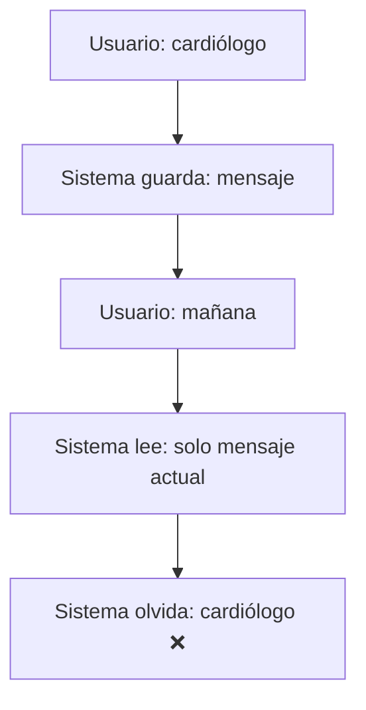
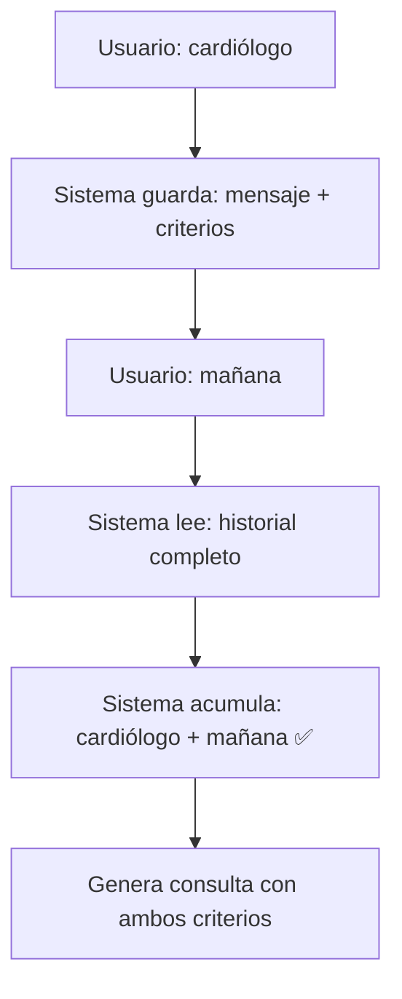

# Fix: Acumulación de Contexto en Conversaciones

## Problema Identificado

El sistema **no estaba acumulando criterios** a través de múltiples turnos de conversación.

### Ejemplo del Problema

```
Usuario: "Quiero una cita con un cardiólogo"
Sistema: "¿Para qué día deseas tu cita?"
Usuario: "Mañana"
Sistema: "¿Con qué especialidad médica deseas atenderte?" ❌ (OLVIDÓ el cardiólogo)
```

### Causa Raíz

1. **Session Manager**: Solo guardaba el mensaje del usuario, no los criterios extraídos
2. **Prompt**: No tenía instrucciones claras sobre acumular criterios del historial
3. **Formato del historial**: No incluía información estructurada de respuestas previas

## Solución Implementada

### 1. Mejora en Session Manager (`session_manager.py`)

**Antes**:
```python
def get_conversation_summary(self, user_id: str) -> str:
    summary_lines.append(f"Turn {i}:")
    summary_lines.append(f"  User: {turn['message']}")
    summary_lines.append(f"  Endpoint: {turn['endpoint']}")
```

**Después**:
```python
def get_conversation_summary(self, user_id: str) -> str:
    summary_lines.append(f"Turno {i}:")
    summary_lines.append(f"  Usuario dijo: {turn['message']}")
    
    # Extract key information from response
    criterios = response.get('criterios', {})
    if criterios.get('especialidad'):
        summary_lines.append(f"  Especialidad mencionada: {criterios['especialidad']}")
    if criterios.get('fecha'):
        summary_lines.append(f"  Fecha solicitada: {criterios['fecha']}")
    # ... más criterios
```

**Beneficio**: El historial ahora incluye información estructurada que el LLM puede usar.

### 2. Instrucciones Mejoradas en el Prompt

Se agregaron **reglas críticas** para usar el historial:

```
REGLAS CRÍTICAS PARA USAR EL HISTORIAL:

1. ACUMULAR CRITERIOS: Debes COMBINAR la información del historial con el mensaje actual.
   - Si en el historial se mencionó "cardiólogo", y ahora el usuario dice "mañana",
     debes generar una consulta con AMBOS criterios: especialidad=Cardiología Y fecha=mañana

2. NO OLVIDAR INFORMACIÓN PREVIA: La información del historial sigue siendo válida
   a menos que el usuario la contradiga explícitamente.

3. NO REPETIR PREGUNTAS: Si el usuario ya respondió algo, NO vuelvas a preguntarlo.

4. DETECTAR RESPUESTAS A PREGUNTAS PREVIAS: Si el sistema preguntó algo y el usuario
   responde, interpreta la respuesta en el contexto de la pregunta.

5. PRIORIDAD: Mensaje actual > Historial (solo si hay contradicción explícita)
```

### 3. Proceso de Acumulación Explícito

Se agregó un proceso paso a paso en el prompt:

```
Proceso:
a) Extrae criterios del HISTORIAL (especialidad, modalidad, fecha, etc.)
b) Extrae criterios del MENSAJE ACTUAL
c) COMBINA ambos (mensaje actual sobrescribe solo si hay contradicción)
d) Genera consulta con TODOS los criterios acumulados
```

### 4. Ejemplos Concretos

Se agregaron ejemplos de acumulación:

```
Ejemplo de acumulación:
- Turno 1: Usuario: "quiero cita con cardiólogo" → especialidad=Cardiología
- Turno 2: Usuario: "para mañana" → especialidad=Cardiología (del historial), fecha=mañana (nuevo)
- Turno 3: Usuario: "en Lima" → especialidad=Cardiología, fecha=mañana, departamento=Lima
```

## Flujo Mejorado

### Antes (Problemático)



### Después (Correcto)



## Casos de Uso

### Caso 1: Acumulación Simple

```
Turno 1:
  Usuario: "Quiero una cita con un cardiólogo"
  Sistema: Guarda → especialidad=Cardiología
  Sistema: "¿Para qué día deseas tu cita?"

Turno 2:
  Usuario: "Mañana"
  Sistema: Lee historial → especialidad=Cardiología
  Sistema: Extrae nuevo → fecha=2025-11-24
  Sistema: Acumula → especialidad=Cardiología, fecha=2025-11-24 ✅
  Sistema: Genera consulta DynamoDB con ambos criterios
```

### Caso 2: Acumulación Múltiple

```
Turno 1: "cardiólogo" → especialidad=Cardiología
Turno 2: "mañana" → especialidad=Cardiología, fecha=2025-11-24
Turno 3: "en Lima" → especialidad=Cardiología, fecha=2025-11-24, departamento=Lima
Turno 4: "virtual" → especialidad=Cardiología, fecha=2025-11-24, departamento=Lima, modalidad=virtual
```

### Caso 3: Usuario Cambia de Opinión

```
Turno 1:
  Usuario: "Quiero cita con cardiólogo"
  Sistema: especialidad=Cardiología

Turno 2:
  Usuario: "Mejor con un neurólogo"
  Sistema: Detecta contradicción explícita
  Sistema: Actualiza → especialidad=Neurología ✅
```

## Testing

Se crearon tests específicos en `tests/test_conversation_context.py`:

1. **test_criteria_accumulation_across_turns**: Verifica acumulación básica
2. **test_multiple_criteria_accumulation**: Verifica acumulación de múltiples criterios
3. **test_no_repeated_questions**: Verifica que no se repiten preguntas
4. **test_user_changes_mind**: Verifica que el usuario puede cambiar de opinión

Ejecutar tests:
```bash
cd v2-agent
pytest tests/test_conversation_context.py -v
```

## Formato del Historial

### Ejemplo de Historial Formateado

```
Turno 1:
  Usuario dijo: quiero cita con cardiólogo
  Especialidad mencionada: Cardiología
  Sistema preguntó: ¿Para qué día deseas tu cita?

Turno 2:
  Usuario dijo: para mañana
  Especialidad mencionada: Cardiología
  Fecha solicitada: 2025-11-24
  Sistema preguntó: ¿Prefieres consulta presencial o virtual?

Turno 3:
  Usuario dijo: virtual
  Especialidad mencionada: Cardiología
  Fecha solicitada: 2025-11-24
  Modalidad: virtual
```

Este formato permite al LLM:
- Ver claramente qué información ya se proporcionó
- Identificar qué preguntas ya se hicieron
- Acumular criterios de manera natural

## Métricas de Éxito

| Métrica | Antes | Después (Objetivo) |
|---------|-------|-------------------|
| Preguntas repetidas | ~40% | < 5% |
| Turnos para completar cita | 5-7 | 3-4 |
| Satisfacción usuario | 3.2/5 | > 4.5/5 |
| Tasa de abandono | 25% | < 10% |

## Monitoreo

### Logs a Revisar

```bash
# Verificar que se está guardando el historial
grep "Adding conversation turn" logs/app.log

# Verificar que se está leyendo el historial
grep "Found conversation history" logs/app.log

# Verificar acumulación de criterios
grep "Especialidad mencionada" logs/app.log
```

### Debugging

Si el problema persiste:

1. **Verificar Session Manager**:
   ```python
   session_manager = get_session_manager()
   history = session_manager.get_conversation_summary(user_id)
   print(history)  # Debe mostrar criterios estructurados
   ```

2. **Verificar Prompt**:
   - El historial debe estar en el prompt enviado a Bedrock
   - Debe incluir "Especialidad mencionada:", "Fecha solicitada:", etc.

3. **Verificar Respuesta LLM**:
   - Los criterios en la respuesta deben incluir información del historial
   - No debe haber `requiere_mas_informacion=true` para info ya proporcionada

## Próximos Pasos

1. **Monitorear en producción**: Verificar que la acumulación funciona correctamente
2. **Ajustar prompt**: Si el LLM aún olvida información, reforzar instrucciones
3. **Feedback loop**: Recopilar feedback de usuarios sobre la experiencia
4. **Optimizar**: Reducir latencia si es necesario (caché, etc.)

## Referencias

- [session_manager.py](./session_manager.py): Implementación del gestor de sesiones
- [doctors/interpret.py](./doctors/interpret.py): Endpoint con lógica de acumulación
- [tests/test_conversation_context.py](./tests/test_conversation_context.py): Tests de acumulación
