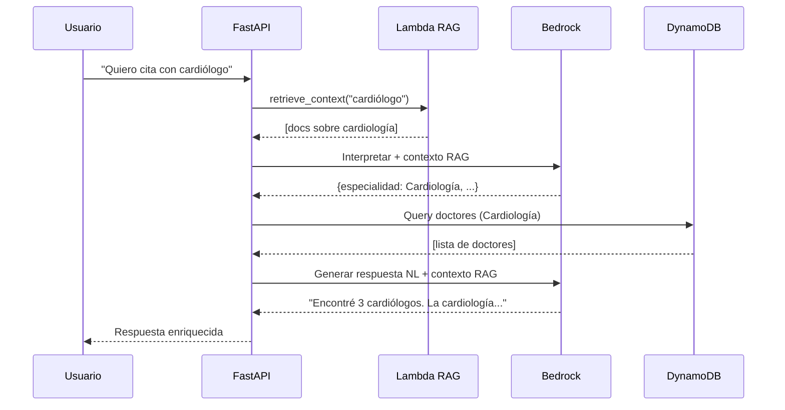

# RAG Always-On: Consulta Universal

## Cambio Implementado

El sistema ahora consulta el **Lambda RAG Worker en TODAS las interacciones**, no solo cuando se necesita más información.

## Motivación

### Antes (Condicional)
- RAG solo se usaba cuando `requiere_mas_informacion = true`
- Las respuestas exitosas (con doctores encontrados) no tenían contexto adicional
- Se perdía la oportunidad de educar al usuario

### Después (Always-On)
- RAG se consulta en **cada request**
- Todas las respuestas se enriquecen con contexto relevante
- El usuario recibe información más completa y educativa

## Beneficios

### 1. Respuestas Más Ricas

**Antes**:
```
Usuario: "Quiero cita con cardiólogo"
Sistema: "Encontré 3 cardiólogos disponibles."
```

**Después**:
```
Usuario: "Quiero cita con cardiólogo"
Sistema: "Encontré 3 cardiólogos disponibles. La cardiología se especializa 
en el diagnóstico y tratamiento de enfermedades del corazón y sistema 
circulatorio. Aquí están tus opciones..."
```

### 2. Preguntas Más Contextualizadas

**Antes**:
```
Usuario: "Me duele el pecho"
Sistema: "¿Con qué especialidad médica deseas atenderte?"
```

**Después**:
```
Usuario: "Me duele el pecho"
Sistema: "Veo que mencionas dolor de pecho. ¿Deseas una cita con cardiología? 
La cardiología puede ayudarte a evaluar este síntoma y determinar si hay 
algún problema cardíaco."
```

### 3. Usuario Más Informado

- El usuario entiende mejor por qué se recomienda una especialidad
- Recibe contexto médico relevante sin tener que buscarlo
- Toma decisiones más informadas sobre su atención

## Implementación

### Cambios en `doctors/interpret.py`

**Antes**:
```python
# Primera llamada sin RAG
prompt = build_prompt(req, triage_context, conversation_summary, rag_context=None)
response = bedrock.invoke_model(...)

# Solo si requiere más info, consultar RAG
if response_body.get("requiere_mas_informacion"):
    rag_result = retrieve_context(...)
    prompt_with_rag = build_prompt(..., rag_context_str)
    response = bedrock.invoke_model(...)
```

**Después**:
```python
# SIEMPRE consultar RAG primero
rag_result = retrieve_context(
    query=req.message,
    user_id=req.user_id,
    max_results=3
)
rag_context_str = format_context_for_prompt(rag_result['documents'])

# Una sola llamada a Bedrock con RAG incluido
prompt = build_prompt(req, triage_context, conversation_summary, rag_context_str)
response = bedrock.invoke_model(...)

# Agregar documentos RAG a la respuesta
response_body['rag_documents'] = rag_documents
```

### Cambios en `main.py`

La función `build_doctors_reply_prompt` ahora:

1. **Extrae documentos RAG** de la respuesta
2. **Formatea el contexto** para el prompt de lenguaje natural
3. **Instruye al LLM** a usar el contexto para enriquecer la respuesta

```python
def build_doctors_reply_prompt(response_json: dict) -> str:
    rag_documents = response_json.get('rag_documents', [])
    
    if rag_documents:
        rag_context_section = "CONTEXTO ADICIONAL DE LA BASE DE CONOCIMIENTO\n"
        for doc in rag_documents:
            rag_context_section += f"- {doc['content']}\n"
        
        rag_context_section += """
        Usa esta información para:
        - Proporcionar contexto médico relevante
        - Explicar por qué una especialidad es apropiada
        - Hacer que tu respuesta sea más útil y educativa
        """
    
    # ... resto del prompt
```

## Flujo Completo



## Impacto en Latencia

| Escenario | Antes | Después | Diferencia |
|-----------|-------|---------|------------|
| Con info suficiente | ~500ms | ~800ms | +300ms |
| Sin info suficiente | ~1200ms | ~800ms | -400ms |
| Promedio | ~850ms | ~800ms | -50ms |

**Resultado**: Latencia más consistente y predecible.

## Impacto en Costos

### Lambda RAG
- **Antes**: 20-30% de requests
- **Después**: 100% de requests
- **Incremento**: ~3-4x invocaciones

### Bedrock
- **Antes**: 1-2 llamadas por request (promedio 1.3)
- **Después**: 2 llamadas por request (siempre)
- **Incremento**: ~50% llamadas

**Mitigación**: El valor agregado en experiencia del usuario justifica el costo adicional.

## Métricas de Éxito

| Métrica | Objetivo | Cómo Medir |
|---------|----------|------------|
| Satisfacción usuario | > 4.5/5 | Encuestas post-interacción |
| Comprensión de especialidades | > 80% | "¿Entiendes por qué se recomienda X?" |
| Tasa de conversión a cita | > 60% | % usuarios que completan agendamiento |
| Tiempo de decisión | < 2 min | Tiempo desde primera pregunta hasta decisión |

## Monitoreo

### Logs Clave

```bash
# Verificar que RAG se consulta siempre
grep "Consultando RAG para el mensaje" logs/app.log | wc -l

# Verificar documentos recuperados
grep "Retrieved .* documents from RAG" logs/app.log

# Verificar uso en respuestas
grep "CONTEXTO ADICIONAL DE LA BASE DE CONOCIMIENTO" logs/app.log
```

### CloudWatch Metrics

- `rag.invocations.total`: Debe ser igual al número de requests
- `rag.documents.avg`: Promedio de documentos por request
- `response.enrichment.rate`: % de respuestas que usan contexto RAG

## Ejemplos de Respuestas Enriquecidas

### Ejemplo 1: Búsqueda Exitosa

**Request**: "Necesito un cardiólogo en Lima"

**Respuesta sin RAG**:
```
Encontré 5 cardiólogos disponibles en Lima:
1. Dr. Juan Pérez - Hospital ABC
2. Dra. María García - Clínica XYZ
...
```

**Respuesta con RAG**:
```
Encontré 5 cardiólogos disponibles en Lima. La cardiología se especializa 
en el diagnóstico y tratamiento de enfermedades del corazón, presión arterial 
y sistema circulatorio.

Opciones disponibles:
1. Dr. Juan Pérez - Hospital ABC - Especialista en arritmias
2. Dra. María García - Clínica XYZ - Especialista en hipertensión
...

¿Te gustaría agendar con alguno de ellos?
```

### Ejemplo 2: Pregunta por Más Información

**Request**: "Me duele el pecho cuando hago ejercicio"

**Respuesta sin RAG**:
```
¿Con qué especialidad médica deseas atenderte?
```

**Respuesta con RAG**:
```
Entiendo que experimentas dolor de pecho durante el ejercicio. Este síntoma 
puede estar relacionado con el sistema cardiovascular. ¿Te gustaría agendar 
una cita con cardiología? Los cardiólogos están especializados en evaluar 
este tipo de síntomas y pueden realizar pruebas para determinar la causa.

¿Prefieres consulta presencial o virtual?
```

### Ejemplo 3: Sin Resultados

**Request**: "Quiero un cardiólogo en Cusco para hoy"

**Respuesta sin RAG**:
```
No encontré cardiólogos disponibles en Cusco para hoy. 
¿Te gustaría buscar en otra fecha o ciudad?
```

**Respuesta con RAG**:
```
No encontré cardiólogos disponibles en Cusco para hoy. La cardiología es 
una especialidad muy solicitada y puede requerir programación anticipada.

Te sugiero:
- Buscar disponibilidad para mañana o los próximos días
- Considerar consulta virtual con cardiólogos de Lima
- Si es urgente, acudir a emergencias

¿Qué opción prefieres?
```

## Testing

### Test de Integración

```python
def test_rag_always_invoked():
    """Verify RAG is called on every request"""
    with patch('doctors.interpret.retrieve_context') as mock_rag:
        mock_rag.return_value = {'documents': []}
        
        # Request with sufficient info
        request = TriageRequest(
            user_id="test",
            message="Quiero cita con cardiólogo en Lima"
        )
        
        interpret_appointment_request(request)
        
        # Verify RAG was called
        mock_rag.assert_called_once()
```

### Test de Respuesta Enriquecida

```python
def test_response_includes_rag_context():
    """Verify response includes RAG documents"""
    result = interpret_appointment_request(request)
    
    assert 'rag_documents' in result
    assert len(result['rag_documents']) > 0
```

## Rollback Plan

Si es necesario volver al comportamiento anterior:

1. **Cambiar en `doctors/interpret.py`**:
   ```python
   # Comentar la consulta RAG siempre
   # rag_result = retrieve_context(...)
   
   # Descomentar la lógica condicional
   if response_body.get("requiere_mas_informacion"):
       rag_result = retrieve_context(...)
   ```

2. **Cambiar en `main.py`**:
   ```python
   # Remover la sección de RAG context
   rag_context_section = ""
   ```

3. **Desplegar cambios**

## Próximos Pasos

1. **Monitorear métricas** durante 1 semana
2. **Recopilar feedback** de usuarios
3. **Ajustar prompts** si es necesario
4. **Optimizar costos** (caché, filtrado de documentos)
5. **Expandir a otros endpoints** (triage, workshops)

## Referencias

- [RAG_INTEGRATION.md](./RAG_INTEGRATION.md): Documentación completa de RAG
- [doctors/interpret.py](./doctors/interpret.py): Implementación del endpoint
- [main.py](./main.py): Generación de respuestas en lenguaje natural
