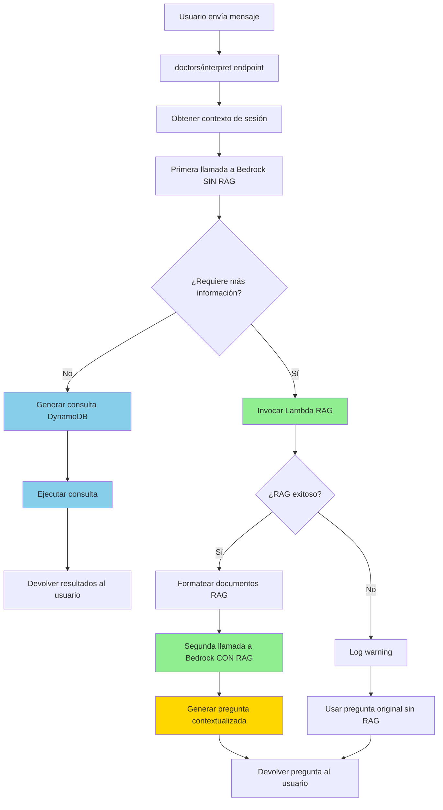
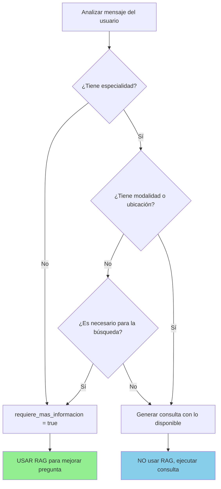
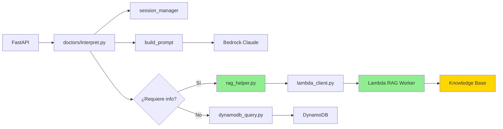
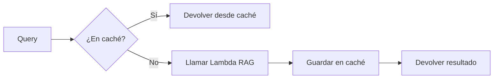
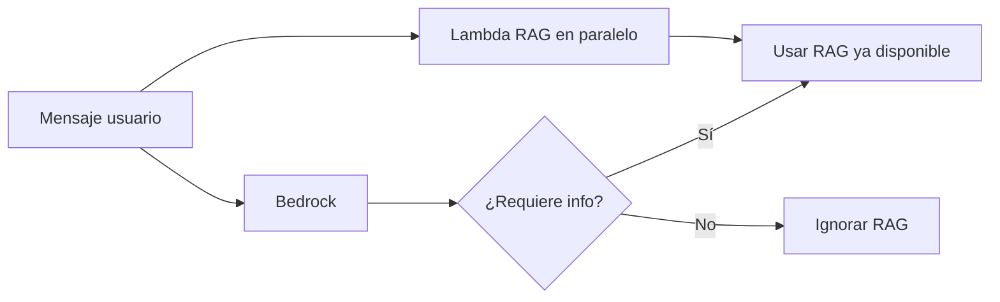
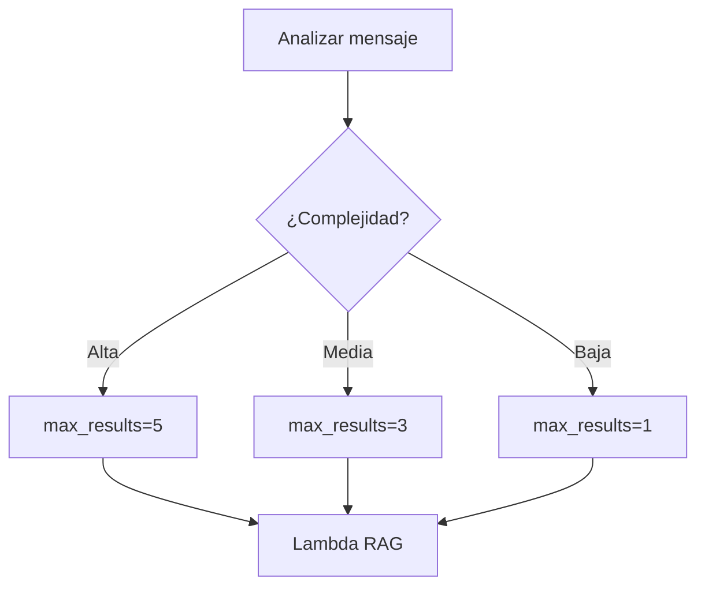

# Flujo de Integración RAG

## Diagrama de Flujo Detallado



## Flujo de Decisión: ¿Cuándo usar RAG?



## Comparación: Con RAG vs Sin RAG

### Escenario 1: Usuario con información completa

| Aspecto | Sin RAG | Con RAG |
|---------|---------|---------|
| **Mensaje** | "Quiero cita con cardiólogo en Lima mañana" | "Quiero cita con cardiólogo en Lima mañana" |
| **RAG invocado** | ❌ No | ❌ No |
| **Llamadas Bedrock** | 1 | 1 |
| **Resultado** | Consulta DynamoDB ejecutada | Consulta DynamoDB ejecutada |
| **Latencia** | ~500ms | ~500ms |

### Escenario 2: Usuario con información incompleta

| Aspecto | Sin RAG | Con RAG |
|---------|---------|---------|
| **Mensaje** | "Necesito una cita" | "Me duele el pecho, necesito ayuda" |
| **RAG invocado** | ❌ No | ✅ Sí |
| **Llamadas Bedrock** | 1 | 2 |
| **Pregunta generada** | "¿Con qué especialidad médica deseas atenderte?" | "Veo que mencionas dolor de pecho. ¿Deseas una cita con cardiología?" |
| **Latencia** | ~500ms | ~1200ms (incluye Lambda) |
| **Experiencia usuario** | Genérica | Contextualizada ⭐ |

## Arquitectura de Componentes



## Secuencia de Llamadas

### Caso A: Sin necesidad de RAG

```
Usuario → FastAPI → doctors/interpret
                         ↓
                    Bedrock (1 llamada)
                         ↓
                    DynamoDB Query
                         ↓
                    Respuesta con doctores
```

**Tiempo total**: ~500-700ms

### Caso B: Con necesidad de RAG

```
Usuario → FastAPI → doctors/interpret
                         ↓
                    Bedrock (1ª llamada)
                         ↓
                    ¿Requiere info? → Sí
                         ↓
                    Lambda RAG (~300ms)
                         ↓
                    Bedrock (2ª llamada)
                         ↓
                    Pregunta contextualizada
```

**Tiempo total**: ~1000-1500ms

## Optimizaciones Futuras

### 1. Caché de RAG


### 2. RAG Paralelo (Especulativo)


### 3. RAG Adaptativo


## Métricas de Éxito

| Métrica | Objetivo | Actual |
|---------|----------|--------|
| Tasa de uso RAG | 20-30% de requests | TBD |
| Latencia p95 con RAG | < 2000ms | TBD |
| Tasa de error RAG | < 1% | TBD |
| Satisfacción usuario | > 4.5/5 | TBD |
| Reducción de preguntas repetidas | > 30% | TBD |

## Monitoreo en CloudWatch

### Logs a buscar

```
# RAG invocado exitosamente
"Retrieved X documents from RAG"

# RAG falló (degradación elegante)
"Warning: Could not retrieve RAG context"

# Segunda llamada con RAG
"Pregunta mejorada con contexto RAG"
```

### Métricas custom

- `rag.invocations.count`: Número de veces que se invoca RAG
- `rag.latency.ms`: Latencia de llamadas RAG
- `rag.errors.count`: Errores en RAG
- `rag.documents.retrieved`: Promedio de documentos obtenidos
